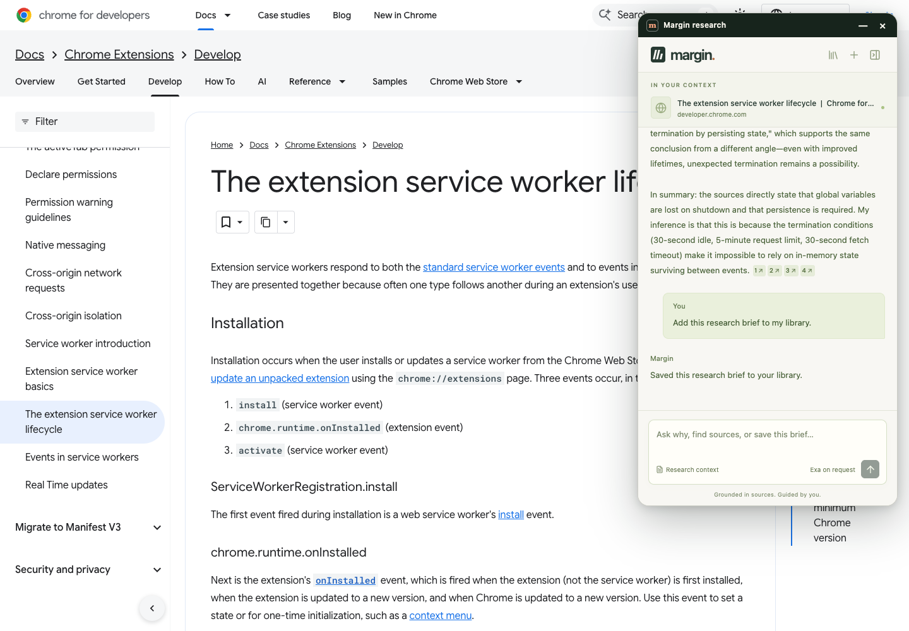
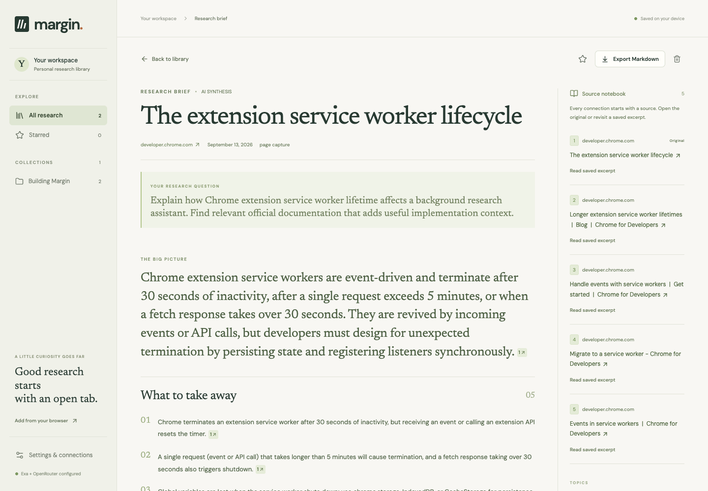
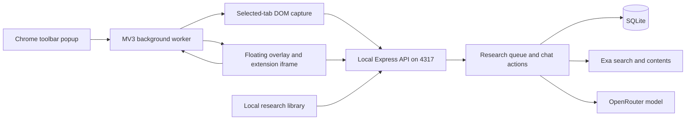

# Margin — a research agent beside the page

Margin turns a selected Chrome tab into a conversation with its sources. Open a website, article, paper, or social post; launch the floating assistant; ask questions; find supporting context with Exa; and save useful research in a local library.

The default model is **`deepseek/deepseek-v4-flash-0731` through OpenRouter**. A brief remains a draft until you click **Add to library** or ask the agent to save it. For questions such as “Why does this brief say it this way?”, the model receives both the generated wording and the captured evidence.

**Current distribution:** an unpacked Chrome extension plus a Node.js server running on the same computer. Each user runs their own server, supplies their own provider keys, and pairs their own extension. A hosted backend, browser-store release, shared credentials, and personal research data are not included.



## Contents

- [Quick start](#quick-start)
- [Using the assistant](#using-the-assistant)
- [Configuration and credentials](#configuration-and-credentials)
- [Architecture and source map](#architecture-and-source-map)
- [Research pipeline and agent actions](#research-pipeline-and-agent-actions)
- [Data and API contracts](#data-and-api-contracts)
- [Development and testing](#development-and-testing)
- [Troubleshooting](#troubleshooting)
- [Running for other users](#running-for-other-users)
- [Handoff for coding agents](#handoff-for-coding-agents)

## Quick start

This build is on **`margin-floating-assistant`**. The repository's `main` branch contains the team's separate Cortex implementation. Use the branch-specific clone below; do not combine the two builds' extension folders or backend instructions.

### 1. Prerequisites

| Requirement | Details |
| --- | --- |
| Node.js | **22.13 or newer**. The initial prototype was tested on Node 22.22.3 and uses built-in `node:sqlite`. |
| npm and Git | Install dependencies with the committed lockfile using `npm ci`. |
| Chrome | Use a current desktop release with unpacked extensions enabled. The manifest declares Chrome 116 minimum; integration tests use Playwright Chromium. |
| OpenRouter key | Needed for generated briefs and interactive model answers. Obtain one from [OpenRouter](https://openrouter.ai/keys) and check access to the selected model. |
| Exa key | Needed for external search. Obtain one from the [Exa dashboard](https://dashboard.exa.ai/api-keys). |

The initial live flow was verified on macOS. Setup uses ordinary Node/npm commands; Windows and Linux are intended targets, but their complete desktop flows have not been verified. No Docker container, external database, Python runtime, or global extension CLI is required.

### 2. Clone, build, and start

```sh
git clone --branch margin-floating-assistant https://github.com/faiqhilman13/agents-hackathon.git
cd agents-hackathon
npm ci
npm run build
npm start
```

Keep the terminal running and open **[http://127.0.0.1:4317/](http://127.0.0.1:4317/)** on the same computer.

The build creates the extension and library frontend in `dist/extension/`. The server serves those assets and the API; `npm start` does not build the UI automatically. Install development dependencies too: the current start command uses `tsx`, and the build needs Vite, TypeScript, esbuild, and sharp. SQLite and configuration files are created on first start.

### 3. Configure providers

Open **Settings & connections** in the library:

1. Enter your Exa and OpenRouter API keys.
2. Keep `deepseek/deepseek-v4-flash-0731`, or enter another compatible model available to your account.
3. Click **Save connections**.
4. Under **Pair your Chrome extension**, click **Copy code**.

The connection code is a separate local API credential, **not** an Exa or OpenRouter key. A **Configured** indicator means a key is stored; an actual research request verifies provider access.

For a key-free UI preview, choose **Explore an example**. It creates an explicitly labeled illustrative brief. Without an LLM key, a real capture produces an extractive digest; follow-up chat requires an LLM. Without Exa, Margin can still discuss the original page.

### 4. Load and pair the extension

1. Open `chrome://extensions` in Chrome and enable **Developer mode**.
2. Click **Load unpacked** and select the cloned repository's **`dist/extension`** folder. Choose the folder containing the generated `manifest.json`, not the repository root or source `extension/` folder.
3. Pin **Margin** in the toolbar if desired.
4. Open the toolbar popup, paste the code into **Connection code**, and click **Connect extension**.
5. Open an article. In Margin's popup, choose its tab and click **Open assistant**.
6. Allow Chrome's site-access request. The floating assistant appears over that page.

The picker includes readable tabs across normal Chrome windows. Selecting an inactive tab does not bring it to the foreground automatically; switch to it to see its panel. Managed-browser policy may prevent loading unpacked extensions.

### 5. Verify the complete interaction

Choose **Research this page**, wait for the brief, and send:

> Why does this brief describe the findings this way? Point me to the evidence.

Then send:

> Add this research brief to my library.

Open **Research library** from the extension. The saved brief, evidence, and conversation should be present. The Node server must remain running throughout this flow.

## Using the assistant

| Interaction | Result |
| --- | --- |
| **Research this page** | Captures the chosen page and enables related-source search. |
| **Help me understand** | Starts with original content and disables external research enrichment. |
| Select a passage before starting | Scopes the captured content to that selection. |
| Ask a follow-up | Discusses the current brief, sources, recent conversation, and notes. |
| **Explain this brief** / **Find more sources** | Fills a suggested request into the composer; send it to execute. |
| “Connect this to my saved research” | Retrieves eligible original documents from the local library. |
| “Save a note: compare this with the earlier study” | Appends a note; does not also save an unsaved brief into the library. |
| **Add to library** / “Save this brief to my library” | Explicitly promotes the draft into the library. |
| **View full brief** | Opens the full document, including an unsaved draft, in the local UI. |
| Drag, collapse, or close | Moves or hides the overlay; queued work continues in the local server. |
| **New conversation** | Clears this tab's current conversation pointer; stored research is not deleted. |

Use **Enter** to send and **Shift+Enter** for a newline. After the initial brief, Exa runs when the agent selects a search action for a request for further evidence. Library features include text search across briefs/sources/notes/conversations, collections, favorites, and Markdown export.



### Supported pages and capture limits

- **Articles and ordinary websites:** Mozilla Readability with semantic-content fallbacks.
- **Signed-in content on supported public web domains:** content already rendered in the selected tab can be read after access is granted. The extension does not forward browser cookies or log into websites on the server's behalf.
- **Social pages:** loaded article/post elements or main content only. No automatic feed scrolling, hidden-reply expansion, or complete account history. Changing site DOMs may affect extraction.
- **arXiv:** abstract/PDF URLs can be resolved to available HTML or full text. Abstract-only results are identified through coverage warnings.
- **PDFs:** use Chrome's native side panel instead of the floating overlay. Only arXiv has a server PDF text-resolution path. Generic PDF extraction is unsupported; open an HTML version.
- **Restricted targets:** browser-internal pages, local files, localhost/private-network addresses, and URLs containing credentials are not supported capture URLs.
- **Navigation:** a full page navigation removes the injected overlay. Reopen it from the popup. Each tab has its own research mapping, and restoration checks the page URL.

## Configuration and credentials

The UI is the easiest setup path. Alternatively, copy `.env.example` to `.env`, edit its values, and restart the server. Use `cp .env.example .env` on macOS/Linux or `Copy-Item .env.example .env` in PowerShell.

| Variable | Default / purpose |
| --- | --- |
| `OPENROUTER_API_KEY` | LLM credential; blank in the template. |
| `LLM_API_KEY` | Optional generic credential; takes precedence over `OPENROUTER_API_KEY` when both environment variables exist. |
| `EXA_API_KEY` | Exa search and optional arXiv PDF text retrieval. |
| `LLM_MODEL` | `deepseek/deepseek-v4-flash-0731`. |
| `LLM_BASE_URL` | `https://openrouter.ai/api/v1`; the server appends `/chat/completions`. |
| `PORT` | `4317`; keep this value for the supplied extension. |
| `MARGIN_DATA_DIR` | `.data`, relative to the directory where the server starts. |

**Precedence is per field:** saved `.data/settings.json` values override environment variables, which override defaults. Changing `.env` will not replace an already saved value; update that field in Settings/API instead.

Advanced OpenAI-compatible endpoints must use HTTPS, or HTTP on `localhost`/`127.0.0.1`. The Settings form targets OpenRouter and writes its base URL when saving. For a different endpoint, use environment configuration without conflicting disk settings, or the authenticated settings API.

The exact default DeepSeek model on `openrouter.ai` receives `reasoning: { enabled: false }` so its bounded output budget is available for the visible JSON answer. This override does not apply to other models/providers. The selected endpoint must support JSON responses compatible with the application schemas.

### Persistence and data flow

| Location | Contents |
| --- | --- |
| `.data/margin.sqlite` | Captures, source text, drafts, briefs, notes, collections, favorites, and conversations. WAL mode may create `-wal`/`-shm` companion files. |
| `.data/settings.json` | Settings entered through the UI/API, including local plaintext provider keys. Not required for environment-only configuration. |
| `.data/connection-token` | Random local API pairing credential. |
| Chrome extension local storage | Pairing code, selected tab, per-tab research IDs, and overlay position. No provider keys. |

`.data`, `.env`, generated builds, and test output are ignored by Git. Provider keys are not bundled into the extension. Restrictive file permissions are requested where supported; this is not encryption at rest.

**Local persistence is not offline inference.** Model requests send bounded captured/source text, questions, and relevant conversation/notes to the configured LLM. Exa receives search queries; its contents API may receive an arXiv PDF URL. Installing the extension does not continuously upload browsing activity.

For a backup, stop the server and copy the entire data directory, including SQLite companion files. For another user, start with a fresh directory and pairing code. Deleting this directory removes research and configuration; it is not a routine troubleshooting step.

## Architecture and source map



Browser capabilities stay in the Chrome worker; long-running research runs in Node. Closing the overlay or Chrome suspending its worker does not own an already queued job's lifetime. The floating shell is a Shadow DOM containing an extension-origin iframe, separate from the page's DOM context.

| Path | Responsibility |
| --- | --- |
| `src/App.tsx` | Library, saved-item filters, brief details, notes, collections, export, setup help. |
| `src/Assistant.tsx` | Conversation, initial research, polling, explicit save UI, per-tab restoration. |
| `src/popup.tsx` | Launcher, pairing, tab picker, permissions, direct PDF side-panel opening. |
| `src/Settings.tsx`, `src/api.ts` | Settings, pairing bootstrap, API client, extension bridge. |
| `src/components.tsx`, `src/style.css` | Visual components, citations, typography, layouts. |
| `extension/manifest.json` | MV3 permissions, CSP, worker, popup, native panel, accessible resources. |
| `extension/background.ts` | Tab validation, overlay control, extraction injection, localhost requests, tab mappings. |
| `extension/overlay.ts` | Draggable shell, bounded position, collapse/expand/close, validated iframe messages. |
| `extension/messages.ts` | Typed extension runtime message contract. |
| `shared/schema.ts` | Zod schemas, URL validation, arXiv parsing, core types. |
| `shared/extract.ts`, `extension/extract.ts` | Shared extraction and injectable entry point. |
| `server/index.ts`, `server/app.ts` | Loopback listener, static frontend, routes, pairing/authentication. |
| `server/research.ts` | Queue orchestration, progress, cancellation, recovery, fallback behavior. |
| `server/providers.ts` | arXiv resolution, Exa, model planning/synthesis, citations, bounded repair. |
| `server/chat.ts`, `server/library.ts` | Conversational action dispatch and saved-original retrieval. |
| `server/store.ts`, `server/settings.ts` | SQLite, configuration precedence, pairing, model options. |
| `server/demo.ts` | Explicit illustrative example; never a claimed live provider result. |
| `vite.config.ts`, `scripts/build-extension.mjs` | Three frontend entry points, browser bundles, manifest, generated icons. |
| `tests/`, `scripts/*test.ts` | Domain/API checks and isolated real-browser tests. |

Stack: React 19, TypeScript, Vite, Express 5, built-in Node SQLite, Zod, Readability, and direct provider HTTP calls. Fonts ship through Fontsource. There is no separate vector database or embedding service.

## Research pipeline and agent actions

### Initial research

1. Chrome requests the exact site's optional permission from a user click. The worker validates the tab and checks for navigation during extraction.
2. A `ResearchInput` with a UUID `requestId` reaches the API. A draft is persisted and its ID returned before research finishes.
3. A FIFO queue runs one research job at a time; the API permits up to ten queued/running jobs combined.
4. The server optionally resolves arXiv content, records coverage, and creates `S0`, the original source.
5. An explicit saved-research question retrieves up to three saved original documents. Library-only questions skip external search unless they also ask for external/current evidence.
6. With enrichment enabled and Exa configured, up to two planned queries request up to four results each. The server filters weak/empty results, deduplicates normalized URLs, and caps the initial source set at nine including the original.
7. The model returns a structured brief. Zod and citation checks validate it. A malformed structured result gets at most one repair attempt; provider HTTP failures are not retried by this repair loop.
8. If synthesis cannot produce a valid result, the job retains a labeled extractive digest and warnings. Missing readable content fails the job rather than inventing a brief.
9. Completion does not change `inLibrary: false`; the user must explicitly save. The panel polls status and stores the ID per tab.

Extraction stores at most 120,000 characters. Initial synthesis receives the first 45,000 characters of the original and up to 10,000 per related source. Capture/model truncation and abstract/selection/social coverage generate warnings. arXiv resolution may call Exa **contents** separately from the two searches, including when external enrichment is off.

After restart, queued jobs resume; previously running jobs become interrupted/failed and require explicit retry. Cancellation uses an abort signal and prevents a late result from overwriting the canceled state.

### Conversational actions

The model returns a **validated JSON action plan**, then a bounded server dispatcher performs it. This is not an arbitrary code executor or general browser-control agent.

| Action | Effect |
| --- | --- |
| `answer` | Explains current page/brief wording/notes using supplied evidence. |
| `search` | Runs one additional Exa search, then answers using relevant sources. |
| `library` | Retrieves originals from saved local briefs, then compares or explains. |
| `note` | Appends an explicitly requested note. |
| `save_brief` | Sets `inLibrary: true` and returns a confirmation. |

Planning uses the latest message, bounded current-brief wording, notes, recent messages, source titles, and eligible library candidates. Answers use at most twelve selected sources and the last eight conversation messages; storage retains the latest hundred messages. Generated wording is context to explain/critique, not independent evidence.

Local retrieval uses keyword-overlap ranking with a recent-candidate fallback, not embeddings. It excludes the current record, demos, unfinished records, and unsaved drafts. It supplies original documents from matched records, not their earlier generated summaries.

### Citation invariants

- `S0` is always the original; the UI displays it as citation **1**.
- Overview/takeaway citations must be exactly `["S0"]`.
- Connections require `S0` plus at least one available related source.
- Unknown or repeated IDs in an initial brief are rejected.
- If only `S0` exists, impossible connection objects are removed; original findings still undergo strict checks.
- Validation checks structure and identifiers, not semantic entailment. Saved excerpts let readers inspect actual support.

## Data and API contracts

### Research records

`shared/schema.ts` is authoritative. A `Research` record includes:

| Field | Meaning |
| --- | --- |
| `id`, `requestId` | Record ID and idempotency key. Reusing an accepted request ID retrieves the existing record; a new UI action creates a new request ID. |
| `status` | `queued`, `running`, `complete`, `failed`, or `cancelled`. |
| `input.capture` | URL, title, text, selection, authors, timestamp, coverage. |
| `sources`, `brief` | Evidence and optional structured synthesis/digest. |
| `mode` | `synthesis`, `extractive`, or `demo`, independent of completion status. |
| `inLibrary` | Explicit library membership; new jobs false, legacy missing values treated as saved by consumers. |
| `notes`, `favorite`, `collection` | User organization; notes limited to 20,000 characters. |
| `messages`, `warnings`, `error` | Conversation history, notices, and failures. |

SQLite stores record IDs, unique request IDs, and JSON records. There is no separate migration framework. Schema changes need compatibility checks against older JSON records.

### Local HTTP API

Base: `http://127.0.0.1:4317/api`. Except status and the local pairing bootstrap, routes require **`Authorization: Bearer <connection-code>`**. Errors return `{ "error": "message" }`.

| Method and route | Purpose |
| --- | --- |
| `GET /status` | Local health and masked configuration flags. No provider keys. |
| `GET /connection` | Pairing bootstrap for the local library; requires its same-origin referer. A bare unauthenticated command-line call returns 403. |
| `GET /settings` | Authenticated masked settings, model, and base URL. |
| `POST /settings` | Updates `exaKey`, `llmKey`, `llmBaseUrl`, and/or `model`; returns masked settings. |
| `GET /research` | All records, including drafts; library UI filters `inLibrary !== false`. |
| `POST /research` | Validates `ResearchInput`; 202 for a new queued record, 200 for an existing request ID. |
| `GET /research/:id` | Full record for polling/restoration/detail. |
| `PATCH /research/:id` | Changes `notes`, `favorite`, `collection`, or `inLibrary: true`. False is rejected: the save operation is promotion-only. |
| `POST /research/:id/chat` | Accepts `{ "message": "..." }`; performs an action and returns the updated record. |
| `POST /research/:id/cancel` | Cancels queued/running research. |
| `POST /research/:id/retry` | Requeues failed/cancelled records only; otherwise 409. |
| `DELETE /research/:id` | Cancels if needed and deletes the record, sources, notes, and conversation. |
| `POST /demo` | Adds/retrieves the explicit illustrative example. Demo chat is rejected. |

Chat needs a complete, non-demo record. Concurrent chat requests for one record return 409. A completed extractive record can receive chat after an LLM is connected. To generate a new full brief after a completed fallback, start a new conversation and research the page again.

For read-only debugging, this command reads the local pairing token without printing it. Run it from the project root; adjust the data path if using another directory:

```sh
node --input-type=module -e 'import {readFileSync} from "node:fs"; const token=readFileSync(".data/connection-token","utf8").trim(); const response=await fetch("http://127.0.0.1:4317/api/research",{headers:{Authorization:"Bearer "+token}}); if(!response.ok) throw new Error("HTTP "+response.status); const records=await response.json(); console.log(records.map(({id,status,mode,inLibrary})=>({id,status,mode,inLibrary})));'
```

Use API mutations for app work rather than hand-editing SQLite. Never substitute actual credentials into committed examples.

### Extension messages and user gestures

`extension/messages.ts` defines `LIST_TABS`, `SELECT_TAB`, `GET_TAB_ACCESS`, `OPEN_ASSISTANT`, `CLOSE_ASSISTANT`, `COLLAPSE_ASSISTANT`, `EXPAND_ASSISTANT`, `CAPTURE_AND_RESEARCH`, `OPEN_LIBRARY`, `GET_EXTENSION_STATE`, and `SETTINGS`.

Success is `{ ok: true, ...payload }`; failure is `{ ok: false, error: { code, message, originPattern? } }`. This differs from the HTTP error envelope.

Site permission requests stay in the UI click handler. PDF opening calls `chrome.sidePanel.open()` directly from the popup click, before unrelated awaits; moving it into an asynchronous background chain loses Chrome's required gesture. Embedded panels bind to the `tabId` URL parameter. The overlay validates the sending iframe window and extension origin before accepting control messages.

## Development and testing

### Commands

| Command | Behavior |
| --- | --- |
| `npm ci` | Installs the locked dependency graph. |
| `npm run build` | Typechecks, builds React entry points, bundles worker/extractor/overlay, copies manifest, generates icons. |
| `npm start` | Serves the existing build and local API. |
| `npm run dev` | Watches/restarts the **server only** via `tsx watch`. No Vite frontend server or automatic extension rebuild. |
| `npm test` | Domain/API tests with temporary stores and fake providers. |
| `npm run check` | Production build plus domain/API tests. |
| `npm run test:browser` | Built library with an isolated browser/database. |
| `npm run test:extension` | Built extension in an isolated Chromium profile with synthetic pages and intercepted API calls. |
| `npm audit` | Dependency advisory check. |

Install Playwright's Chromium for browser tests:

```sh
npx playwright install chromium
npm run check
npm run test:browser
npm run test:extension
```

On Linux CI, `npx playwright install --with-deps chromium` also installs browser system dependencies. The library check tries installed Chrome first and falls back to Playwright Chromium; the extension check uses the Playwright Chromium channel. These tests do not require provider keys or your development server.

The extension harness grants synthetic fixture origins and intercepts localhost API requests. It tests restrictive page CSP, inactive-tab extraction, independent overlays, drag/resize/collapse geometry, restoration, draft UI, and native PDF panel opening. The visible Chrome permission dialog remains a manual browser-owned interaction.

The initial verification had **25 passing domain/API tests**, successful library/extension browser checks, and a live Exa/DeepSeek explanation-and-save flow. Read the [verification record](docs/verification.md) for exact boundaries and the [two-minute demo script](docs/demo-script.md) for presentation steps. Screenshots above document that run; they do not replace live setup.

### Editing and updating

Edit source, not `dist/extension`, which is replaced by the build. After frontend/extension changes:

1. Run `npm run build`.
2. Click **Reload** on Margin in `chrome://extensions`.
3. Refresh any page with an old injected panel, then reopen the assistant.
4. Refresh the library. Restart `npm start` after backend changes, or use the server watcher during development.

To update a clean checkout, stop its server and run:

```sh
git pull --ff-only
npm ci
npm run build
npm start
```

Preserve local edits before pulling. Ignored research/settings survive these steps. Keep the same unpacked-extension directory when reloading; if Chrome creates a new installation and loses local storage, pair again.

### Changing the server address

The extension is wired to **4317**. `PORT` changes only the Node listener and its local-origin allowlist. It does not reconfigure the extension. A future address change must update client URLs in `src/api.ts` and `src/popup.tsx`, the worker URL in `extension/background.ts`, permissions/CSP in `extension/manifest.json`, and affected browser tests together. Rebuild/reload and verify pairing plus embedded requests.

## Troubleshooting

| Symptom | Check / fix |
| --- | --- |
| `node:sqlite` missing | Check `node --version` in the actual terminal; use Node 22.13+. Node 22's experimental SQLite notice alone is not a startup failure. |
| Empty page or missing assets | Run `npm run build` and start from the repository root; static files resolve relative to the working directory. |
| `EADDRINUSE` on 4317 | Check the existing process. Reuse or deliberately stop your earlier Margin instance; changing only `PORT` breaks extension connectivity. |
| Popup reports offline | Open `http://127.0.0.1:4317/` on the same machine. Keep Node running and inspect its terminal. |
| Pairing/401 error | Copy the current local connection code into extension setup; provider keys are not pairing codes. |
| `/api/connection` returns 403 | Open the actual local library URL. A file-opened HTML page or bare curl call does not provide the required bootstrap referer. |
| Provider 401/403 | Replace the rejected provider key; check account/model access. Configured does not mean validated. |
| Provider 402/429 | Check account credit or rate limits. Repeated retries may consume more quota. |
| `.env` changes ignored | Saved disk settings override environment fields. Update Settings/API and restart for environment changes. |
| Panel missing | Switch to the selected tab, grant site access, and reopen after navigation or extension reload. |
| PDF text unavailable | Use HTML; only arXiv has a PDF resolver. A native panel does not make generic PDFs readable. |
| Social capture incomplete | Expand posts/replies yourself or select a passage. Only loaded content is captured. |
| Completed brief absent from library | It is likely a draft. Click **Add to library** or explicitly ask the agent to save it. |
| Brief is an extractive digest | Read the provider/JSON/citation warning. After fixing the cause, start a new conversation for a new brief. |
| Interrupted job after restart | Use **Retry research**; the captured input is preserved. |
| Browser executable missing | Run `npx playwright install chromium`; Linux may also need system libraries. |

## Running for other users

The supported prototype path is **one local installation per user**: clone/build, run the loopback server, enter individual keys, load the unpacked extension, and pair. A prebuilt `dist/extension` folder can be distributed with these instructions, but it still needs the local server. Store packaging and a desktop server installer are not implemented.

The backend binds to `127.0.0.1` and has one local pairing credential/library. It has no separate accounts or per-user authorization. Allowed extension origins still require the bearer token. Captured documents are treated as untrusted model input, but this remains a hackathon prototype rather than a completed production security boundary.

A hosted/multi-user version needs a separate implementation: user authentication, data ownership, encrypted credential management, HTTPS and revised extension configuration, quotas, durable worker deployment, and backup/migration operations. Uploading just the static UI or exposing this local API publicly does not provide those capabilities.

## Handoff for coding agents

Read this README and [AGENTS.md](AGENTS.md). Inspect the actual checkout and configuration; another agent's server, credentials, database, or Chrome profile will not exist on a fresh machine.

Preserve these contracts:

1. Research begins as a durable draft. Ordinary answers and notes do not implicitly save it into the library.
2. Each floating panel owns its tab context; another tab must not retarget its conversation.
3. Keep browser capture, server orchestration, and model-selected actions at their boundaries, including user-gesture requirements.
4. Keep provider keys out of tracked files, client bundles, logs, and screenshots. Document blank placeholders in `.env.example`.
5. Preserve citation checks, capture coverage, bounded repair, and labeled fallbacks. Do not pass demo data off as live output.
6. Check older JSON records when changing schemas. Use isolated test stores, not the user's `.data`.
7. Run checks relevant to the changed layer. Keep deliberate, user-authorized live calls separate from automated tests.

A handoff should state branch/commit, changed files, configuration assumptions, whether a server is running, actual tests completed, and remaining manual browser steps. Distinguish a passing build from a verified extension or live model flow.

## Hackathon origin

The application, extension, tests, documentation, and build script were created during the current hackathon build period. Third-party packages are reusable building blocks under their own licenses; `package.json` and `package-lock.json` record them. Public source: [faiqhilman13/agents-hackathon](https://github.com/faiqhilman13/agents-hackathon).
